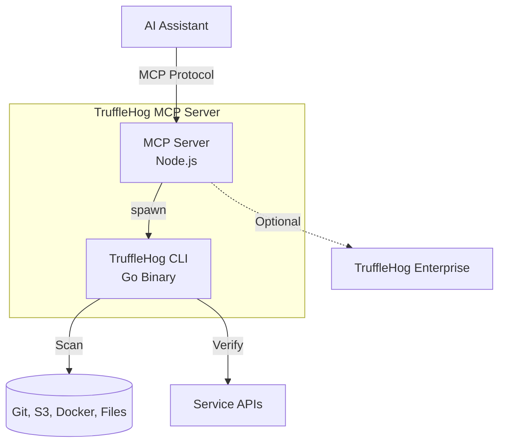

# Architecture Documentation - TruffleHog MCP Server

## Overview

This directory contains comprehensive architecture documentation for the TruffleHog MCP Server, a Model Context Protocol server that wraps the TruffleHog CLI to provide AI-powered secret detection and scanning capabilities.

## Document Index

| Document | Description | Audience |
|----------|-------------|----------|
| [context.md](context.md) | C4 Level 1 - System Context | All stakeholders |
| [containers.md](containers.md) | C4 Level 2 - Container View | Developers, Ops |
| [components.md](components.md) | C4 Level 3 - Component View | Developers |
| [deployment.md](deployment.md) | Deployment architecture and environments | Ops, DevOps |
| [data-flows.md](data-flows.md) | Data flow diagrams and sensitive data paths | Security, Developers |
| [security.md](security.md) | Threat model and security controls | Security, Developers |
| [togaf-mapping.md](togaf-mapping.md) | TOGAF enterprise architecture views | Architects |
| [decisions.md](decisions.md) | Architecture Decision Records (ADRs) | Architects, Developers |

## Quick Navigation

### For Developers

1. Start with [context.md](context.md) for system overview
2. Review [components.md](components.md) for code structure
3. Check [decisions.md](decisions.md) for design rationale

### For Security Review

1. Review [security.md](security.md) for threat model
2. Check [data-flows.md](data-flows.md) for sensitive data handling
3. Review trust boundaries in [context.md](context.md)

### For Operations

1. Review [deployment.md](deployment.md) for setup
2. Check [containers.md](containers.md) for dependencies
3. Review environment configuration

### For Enterprise Architects

1. Start with [togaf-mapping.md](togaf-mapping.md) for TOGAF alignment
2. Review [context.md](context.md) for business context
3. Check [decisions.md](decisions.md) for architectural decisions

## Architecture Summary

## Key Characteristics

| Characteristic | Value |
|----------------|-------|
| **Type** | MCP Server (CLI Wrapper) |
| **Runtime** | Node.js 18+ |
| **Language** | TypeScript |
| **External Dependency** | TruffleHog CLI |
| **Transport** | stdio (JSON-RPC) |
| **State** | Stateless |
| **Authentication** | None (MCP standard) |

## Available Tools

| Tool | Purpose |
|------|---------|
| `trufflehog_status` | Check installation and configuration |
| `scan_git_repo` | Scan Git repository for secrets |
| `scan_github_org` | Scan GitHub organization |
| `scan_filesystem` | Scan local directory |
| `scan_s3_bucket` | Scan AWS S3 bucket |
| `scan_docker_image` | Scan Docker image |
| `list_detectors` | List available secret detectors |
| `verify_secret` | Verify if secret is active |
| `generate_config` | Generate scanner configuration |
| `analyze_finding` | Get remediation guidance |

## Diagram Inventory

### C4 Diagrams

| Diagram | Location | Description |
|---------|----------|-------------|
| System Context | [context.md](context.md) | External actors and systems |
| Container Diagram | [containers.md](containers.md) | Deployable units |
| Component Diagram | [components.md](components.md) | Internal structure |

### Flow Diagrams

| Diagram | Location | Description |
|---------|----------|-------------|
| Scanning Flow | [data-flows.md](data-flows.md) | End-to-end scan data flow |
| Verification Flow | [data-flows.md](data-flows.md) | Secret verification process |
| Trust Boundaries | [security.md](security.md) | Security boundary visualization |

### Deployment Diagrams

| Diagram | Location | Description |
|---------|----------|-------------|
| Local Deployment | [deployment.md](deployment.md) | Developer workstation setup |
| Enterprise Topology | [deployment.md](deployment.md) | Multi-user Enterprise setup |

## Document Conventions

### Mermaid Diagrams

All diagrams are in Mermaid format for GitHub rendering. To view:
1. GitHub renders Mermaid natively
2. Use Mermaid Live Editor: https://mermaid.live
3. VS Code with Mermaid extension

### Status Indicators

- **Implemented**: Feature exists in codebase
- **Not Implemented**: Gap identified
- **Partial**: Incomplete implementation
- **External**: Handled by dependency

### Risk Levels

- **Low**: Minimal concern
- **Medium**: Should be addressed
- **High**: Requires attention
- **Critical**: Immediate action needed

## Version History

| Version | Date | Author | Changes |
|---------|------|--------|---------|
| 1.0.0 | 2025-01-16 | Architecture Review | Initial documentation |

## Contributing

When updating architecture documentation:

1. Keep diagrams in sync with code
2. Update affected documents together
3. Document decisions in [decisions.md](decisions.md)
4. Run Mermaid validation before committing

## Related Documentation

- [README.md](../../README.md) - Project overview and usage
- [TruffleHog Documentation](https://docs.trufflesecurity.com/) - External CLI docs
- [MCP Protocol Specification](https://modelcontextprotocol.io/) - Protocol details

## Open Questions and Gaps

The following gaps are tracked across all documents:

### Security Gaps
- GitHub tokens visible in process list
- Temp file race condition for verification
- No authentication at MCP level

### Functional Gaps
- No unit tests
- No progress reporting for long scans
- No result caching

### Operational Gaps
- No health check endpoint
- No metrics/observability
- No graceful shutdown

See individual documents for detailed gap analysis.
