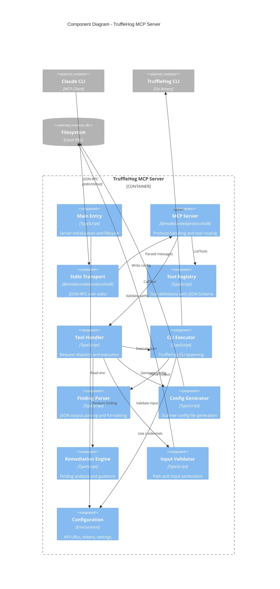
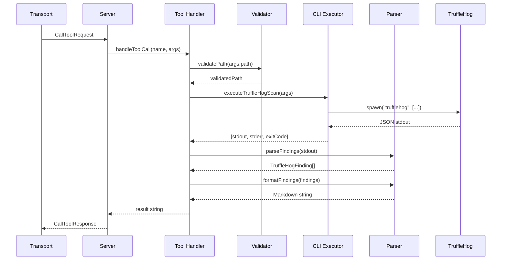
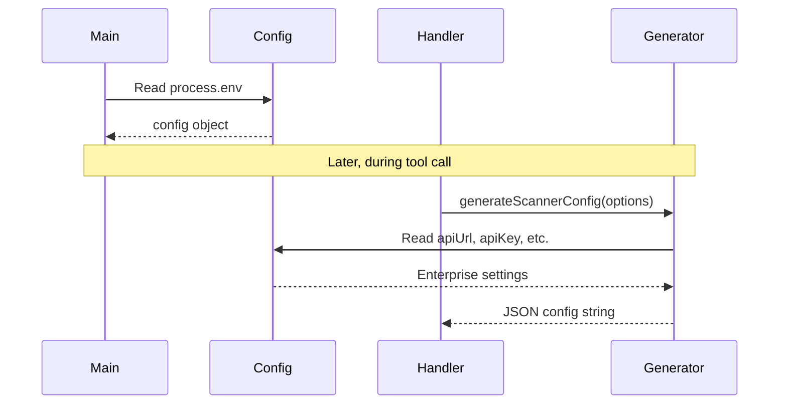

# Component Diagram - TruffleHog MCP Server

## Overview

This document describes the component-level architecture (C4 Level 3) of the TruffleHog MCP Server. It details the internal structure of the Node.js MCP server application.

## C4 Level 3: Component Diagram



## Component Details

### Main Entry (`main()`)

**File**: `src/index.ts` (lines 953-1005)

**Responsibilities:**
- Initialize MCP Server instance
- Register request handlers for ListTools and CallTool
- Create stdio transport
- Connect server to transport
- Log server startup

**Code Structure:**
```typescript
async function main() {
  const server = new Server({...}, {...});
  server.setRequestHandler(ListToolsRequestSchema, ...);
  server.setRequestHandler(CallToolRequestSchema, ...);
  const transport = new StdioServerTransport();
  await server.connect(transport);
}
```

### Tool Registry

**File**: `src/index.ts` (lines 210-468)

**Responsibilities:**
- Define all available MCP tools
- Provide JSON Schema definitions for tool inputs
- Document tool descriptions for AI consumption

**Registered Tools:**

| Tool Name | Purpose | Required Inputs |
|-----------|---------|-----------------|
| `trufflehog_status` | Check CLI installation and config | None |
| `scan_git_repo` | Scan git repository | `target` (URL or path) |
| `scan_github_org` | Scan GitHub organization | `org` name |
| `scan_filesystem` | Scan local directory | `path` |
| `scan_s3_bucket` | Scan S3 bucket | `bucket` name |
| `scan_docker_image` | Scan Docker image | `image` name:tag |
| `list_detectors` | List available detectors | None |
| `verify_secret` | Verify secret validity | `secret`, `detectorType` |
| `generate_config` | Generate scanner config | Optional sources |
| `analyze_finding` | Analyze and remediate | `detectorType` |

### Tool Handler (`handleToolCall()`)

**File**: `src/index.ts` (lines 471-949)

**Responsibilities:**
- Route tool calls to appropriate implementation
- Handle input extraction and type coercion
- Manage error handling and response formatting
- Return formatted markdown results

**Dispatch Pattern:**
```typescript
async function handleToolCall(name: string, args: Record<string, unknown>): Promise<string> {
  switch (name) {
    case "trufflehog_status": { /* ... */ }
    case "scan_git_repo": { /* ... */ }
    // ... other cases
    default: return `Unknown tool: ${name}`;
  }
}
```

### CLI Executor (`executeTruffleHogScan()`)

**File**: `src/index.ts` (lines 62-99)

**Responsibilities:**
- Spawn TruffleHog CLI as child process
- Collect stdout and stderr streams
- Handle process completion and errors
- Return structured result with exit code

**Security Features:**
- Uses `spawn()` with explicit args array (no shell injection)
- `shell: false` explicitly set
- Arguments passed as array, not string

**Code Structure:**
```typescript
async function executeTruffleHogScan(args: string[]): Promise<{
  stdout: string;
  stderr: string;
  exitCode: number;
}> {
  return new Promise((resolve) => {
    const proc = spawn("trufflehog", args, {
      stdio: ["pipe", "pipe", "pipe"],
      shell: false,
    });
    // Stream handling...
  });
}
```

### Finding Parser (`parseFindings()`, `formatFindings()`)

**File**: `src/index.ts` (lines 101-160)

**Responsibilities:**
- Parse newline-delimited JSON output from CLI
- Extract structured finding data
- Format findings as markdown for readability

**Finding Structure:**
```typescript
interface TruffleHogFinding {
  SourceMetadata: { Data: Record<string, unknown> };
  SourceID: number;
  SourceType: number;
  SourceName: string;
  DetectorType: number;
  DetectorName: string;
  DecoderName: string;
  Verified: boolean;
  Raw: string;
  RawV2: string;
  Redacted: string;
  ExtraData: Record<string, unknown>;
  StructuredData?: Record<string, unknown>;
}
```

### Config Generator (`generateScannerConfig()`)

**File**: `src/index.ts` (lines 163-194)

**Responsibilities:**
- Build scanner configuration objects
- Include TruffleHog Enterprise settings
- Support source and notifier configuration
- Serialize to JSON format

### Remediation Engine

**File**: `src/index.ts` (lines 838-944)

**Responsibilities:**
- Provide detector-specific remediation guidance
- Assess risk based on verification status
- Document immediate actions, investigation steps, prevention measures
- Cover AWS, GitHub, Slack, and generic secrets

### Input Validator (`validatePath()`)

**File**: `src/index.ts` (lines 197-207)

**Responsibilities:**
- Resolve paths to absolute form
- Prevent null byte injection
- Basic directory traversal prevention

**Limitations:**
- Does not check for symlink attacks
- Does not verify path existence
- Minimal validation logic

### Configuration

**File**: `src/index.ts` (lines 33-39)

**Environment Variables:**
```typescript
const config = {
  apiUrl: process.env.TRUFFLEHOG_API_URL || "",
  apiKey: process.env.TRUFFLEHOG_API_KEY || "",
  scannerGroup: process.env.TRUFFLEHOG_SCANNER_GROUP || "",
  webhookUrl: process.env.TRUFFLEHOG_WEBHOOK_URL || "",
  webhookToken: process.env.TRUFFLEHOG_WEBHOOK_TOKEN || "",
};
```

## Component Interactions

### Tool Execution Sequence



### Configuration Reading Sequence



## Code Metrics

| Metric | Value |
|--------|-------|
| Total Lines of Code | ~1000 |
| Number of Functions | 12 |
| Number of Tools | 10 |
| External Dependencies | 3 (MCP SDK, axios, yaml) |
| TypeScript Strict Mode | Enabled |

## Dependency Graph

```mermaid
graph TD
    A[index.ts] --> B[@modelcontextprotocol/sdk]
    A --> C[child_process]
    A --> D[fs]
    A --> E[path]
    A --> F[os]

    B --> B1[Server]
    B --> B2[StdioServerTransport]
    B --> B3[Types]

    subgraph "Node.js Built-ins"
        C
        D
        E
        F
    end

    subgraph "External Dependencies"
        B
    end
```

## Open Questions and Gaps

1. **Single File Architecture**: All code in one 1000-line file; would benefit from modular refactoring
2. **No Unit Tests**: No test files present; testing relies on manual verification
3. **Limited Error Types**: Uses generic Error; no custom error classes
4. **No Logging Framework**: Uses console.error only for startup message
5. **No TypeScript Strict Null Checks**: Could improve null safety
6. **Synchronous Helpers**: `isTruffleHogInstalled()` and `getTruffleHogVersion()` use sync exec
7. **No Dependency Injection**: Components are tightly coupled; harder to test in isolation
