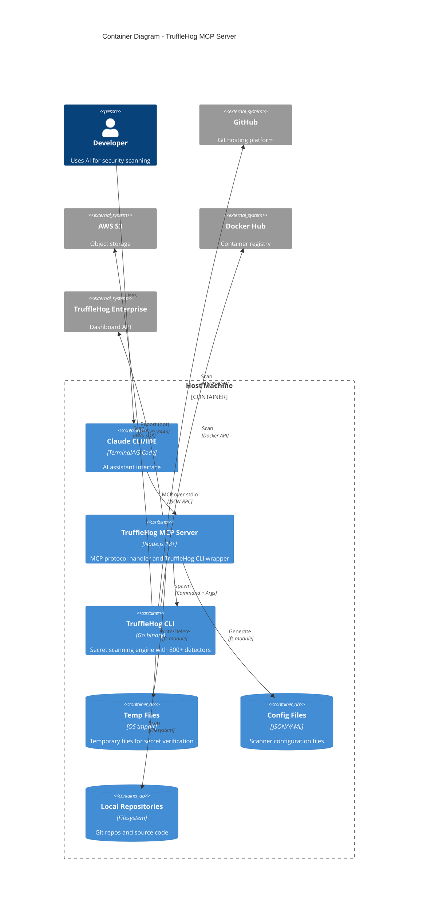
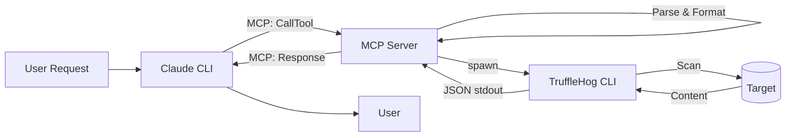
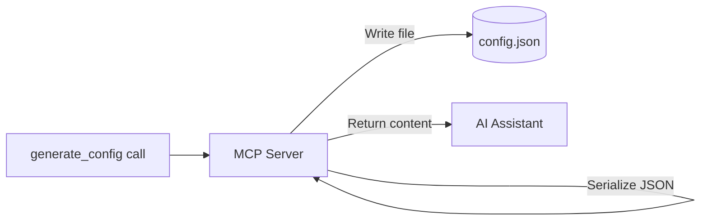
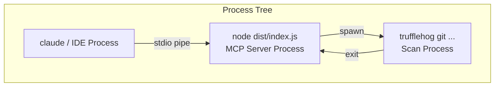

# Container Diagram - TruffleHog MCP Server

## Overview

This document describes the container-level architecture (C4 Level 2) of the TruffleHog MCP Server system. At this level, a "container" refers to a separately deployable/runnable unit, not specifically Docker containers.

## C4 Level 2: Container Diagram



## Container Descriptions

### TruffleHog MCP Server

| Property | Value |
|----------|-------|
| **Type** | Node.js Application |
| **Runtime** | Node.js 18+ with ES2022 target |
| **Module System** | ESM (ES Modules) |
| **Entry Point** | `dist/index.js` |
| **Protocol** | MCP over stdio (JSON-RPC 2.0) |

**Responsibilities:**
- Register and expose 10 MCP tools for secret scanning
- Handle MCP protocol messages via stdio transport
- Validate and sanitize user inputs
- Spawn TruffleHog CLI with appropriate arguments
- Parse JSON output from CLI stdout
- Format findings for AI consumption
- Generate scanner configuration files
- Provide remediation guidance

**Key Dependencies:**
```json
{
  "@modelcontextprotocol/sdk": "^1.0.0",
  "axios": "^1.6.0",
  "yaml": "^2.3.4"
}
```

### TruffleHog CLI

| Property | Value |
|----------|-------|
| **Type** | External Binary |
| **Language** | Go |
| **Installation** | `brew install trufflehog` or GitHub releases |
| **Interface** | CLI with JSON output support |

**Responsibilities:**
- Scan various sources for secrets (git, filesystem, S3, Docker)
- Apply 800+ secret detectors with pattern matching and entropy analysis
- Verify secrets against service APIs
- Output findings in JSON or human-readable format

**Scan Modes:**
- `trufflehog git <url>` - Git repository scanning
- `trufflehog filesystem <path>` - Local filesystem scanning
- `trufflehog github --org <name>` - GitHub organization scanning
- `trufflehog s3 --bucket <name>` - S3 bucket scanning
- `trufflehog docker --image <name>` - Docker image scanning

### Claude CLI / IDE Integration

| Property | Value |
|----------|-------|
| **Type** | Client Application |
| **Examples** | Claude CLI, VS Code with Claude extension |
| **Protocol** | MCP client |

**Responsibilities:**
- Provide user interface for AI interaction
- Manage MCP server lifecycle
- Route tool calls to appropriate MCP servers
- Present results to users

## Data Flows

### Scanning Flow



### Configuration Generation Flow



## Runtime Characteristics

### Process Model



### Memory Characteristics

| Component | Typical Memory | Notes |
|-----------|---------------|-------|
| MCP Server | 50-100 MB | Node.js baseline + buffers for CLI output |
| TruffleHog CLI | 100-500 MB | Varies based on scan target size |
| Combined | 150-600 MB | Peak during active scanning |

### I/O Patterns

| Component | I/O Type | Characteristics |
|-----------|----------|-----------------|
| MCP Server | stdin/stdout | Low volume, JSON messages |
| MCP Server | File I/O | Temp files for verification, config generation |
| TruffleHog CLI | Network I/O | High volume when scanning remote targets |
| TruffleHog CLI | Disk I/O | Cloning repos, reading filesystem |

## Networking

### Outbound Connections

| Source | Destination | Port | Protocol | Purpose |
|--------|-------------|------|----------|---------|
| TruffleHog CLI | GitHub | 443 | HTTPS | Clone/scan repos |
| TruffleHog CLI | GitHub | 22 | SSH | Clone repos (if SSH configured) |
| TruffleHog CLI | AWS S3 | 443 | HTTPS | Scan buckets |
| TruffleHog CLI | Docker Registry | 443 | HTTPS | Pull image layers |
| TruffleHog CLI | Various APIs | 443 | HTTPS | Secret verification |
| MCP Server | TruffleHog Enterprise | 8443 | HTTPS | Result reporting (Enterprise) |

### No Inbound Connections

The system does not listen on any network ports. All communication is via:
- stdio (MCP protocol)
- Child process spawning

## Deployment Considerations

### Prerequisites

1. **Node.js 18+**: Required for MCP server runtime
2. **TruffleHog CLI**: Must be installed and in PATH
3. **MCP Client**: Claude CLI or compatible IDE

### Configuration

Environment variables for Enterprise features:
```bash
TRUFFLEHOG_API_URL=your-namespace.api.c1.prod.trufflehog.org:8443
TRUFFLEHOG_API_KEY=thog-agent-XXXXXXXX
TRUFFLEHOG_SCANNER_GROUP=default
TRUFFLEHOG_WEBHOOK_URL=https://your-webhook.example.com
TRUFFLEHOG_WEBHOOK_TOKEN=webhook-secret
```

## Open Questions and Gaps

1. **No Health Checks**: MCP server has no health check endpoint or liveness probe
2. **No Graceful Shutdown**: Running scans may be interrupted on process termination
3. **No Connection Pooling**: Each scan spawns a new process
4. **No Output Streaming**: Large scans must complete before returning results
5. **Binary Dependency**: Requires TruffleHog CLI to be pre-installed
