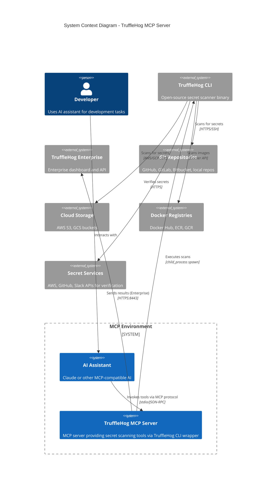
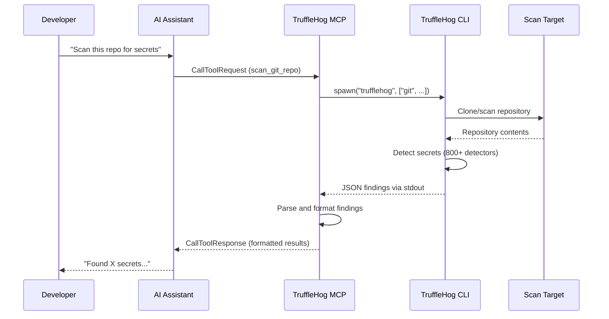
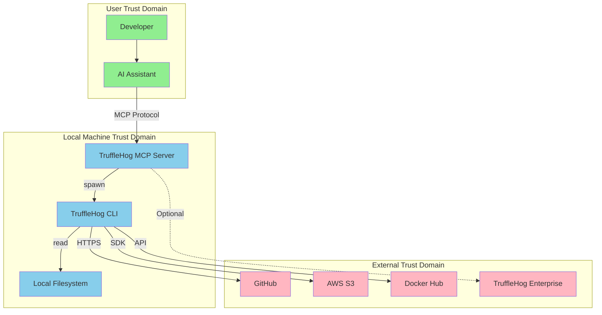

# System Context - TruffleHog MCP Server

## Overview

The TruffleHog MCP Server is a Model Context Protocol (MCP) server that wraps the TruffleHog CLI, providing AI assistants (like Claude) with secret detection and scanning capabilities. It acts as a bridge between AI-powered development environments and TruffleHog's security scanning infrastructure.

## C4 Level 1: System Context Diagram

## Actors and Systems

### Primary Actors

| Actor | Description | Interaction |
|-------|-------------|-------------|
| Developer | Security-conscious developer using AI assistance | Initiates scans through natural language requests |
| AI Assistant | Claude or other MCP-compatible AI | Translates requests to MCP tool calls |

### Internal Systems

| System | Description | Role |
|--------|-------------|------|
| TruffleHog MCP Server | Node.js MCP server | Bridges MCP protocol to TruffleHog CLI |

### External Systems

| System | Description | Integration |
|--------|-------------|-------------|
| TruffleHog CLI | Open-source secret scanner | Child process execution via spawn |
| TruffleHog Enterprise | Commercial dashboard/API | Optional HTTPS API for result aggregation |
| Git Repositories | Source code hosts | Target for git-based scans |
| Cloud Storage (S3/GCS) | Object storage | Target for bucket scans |
| Docker Registries | Container image storage | Target for image layer scans |
| Secret Service APIs | AWS, GitHub, Slack, etc. | Used for active secret verification |

## Communication Patterns

### MCP Protocol Communication

### Transport Protocol

- **MCP Transport**: stdio (stdin/stdout)
- **Message Format**: JSON-RPC 2.0
- **CLI Communication**: Child process with separate stdout/stderr streams

## Trust Boundaries

## Key Responsibilities

### TruffleHog MCP Server

1. **Tool Registration**: Exposes 10 scanning and analysis tools via MCP
2. **Input Validation**: Validates paths and sanitizes inputs before CLI execution
3. **CLI Orchestration**: Safely spawns TruffleHog CLI with proper arguments
4. **Output Parsing**: Parses JSON output from TruffleHog and formats for AI consumption
5. **Configuration Management**: Manages Enterprise configuration via environment variables
6. **Remediation Guidance**: Provides contextual remediation advice for findings

### TruffleHog CLI (External)

1. **Secret Detection**: 800+ detector types for various secret formats
2. **Verification**: Active verification of secrets against service APIs
3. **Multi-source Scanning**: Git, filesystem, S3, Docker, GitHub org scanning
4. **History Analysis**: Scans full git history for historical secrets

## Open Questions and Gaps

1. **No Rate Limiting**: The MCP server does not implement rate limiting for scan requests
2. **No Caching**: Repeated scans of the same target always re-execute
3. **No Progress Reporting**: Long-running scans provide no intermediate progress updates
4. **Enterprise Integration**: Dashboard integration is configuration-only; no bidirectional sync
5. **Credential Management**: GitHub/AWS tokens passed as arguments (visible in process list)
