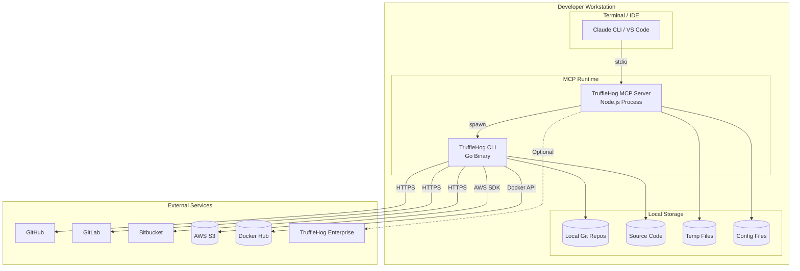
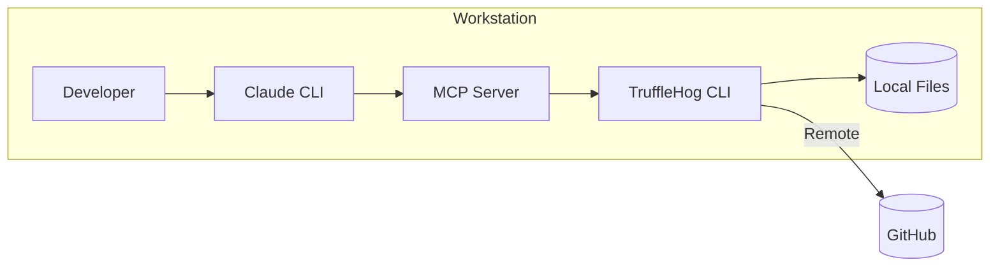
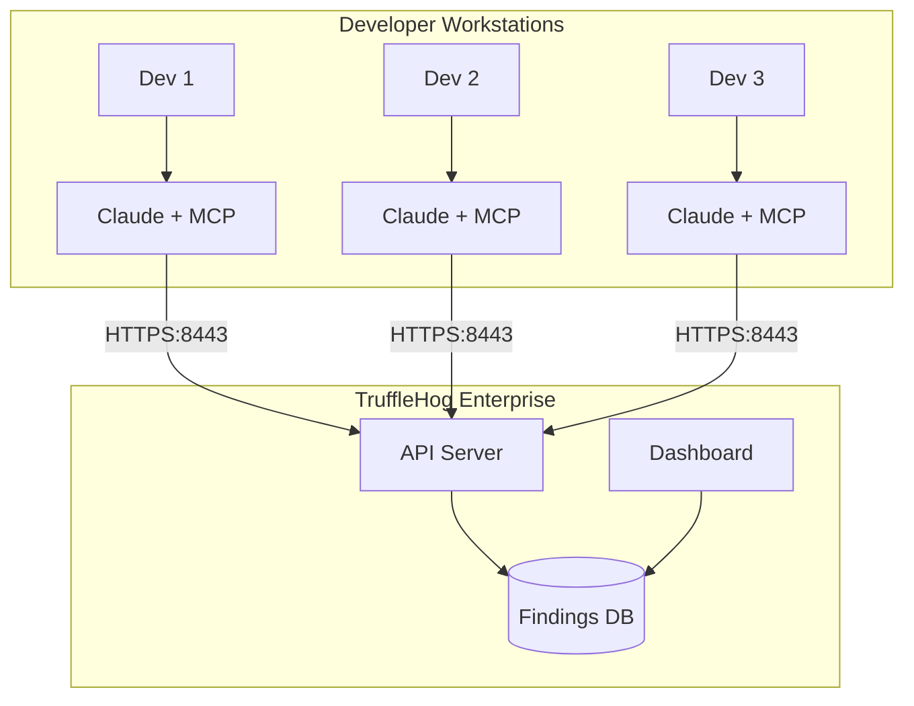
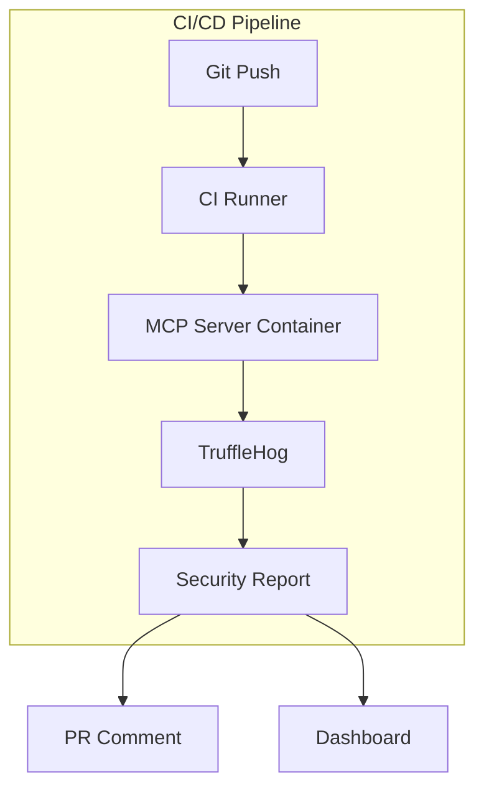

# Deployment Architecture - TruffleHog MCP Server

## Overview

The TruffleHog MCP Server is designed as a local development tool that runs alongside an MCP-compatible AI client. This document describes deployment patterns for various environments.

## Deployment Diagram



## Environment Specifications

### Local Development Environment

| Component | Specification |
|-----------|---------------|
| **Platform** | macOS, Linux, Windows (WSL) |
| **Node.js** | 18.0+ |
| **TruffleHog CLI** | Latest stable |
| **Memory** | 8GB+ recommended |
| **Disk** | Depends on scan targets |
| **Network** | Outbound HTTPS required for remote scans |

### Installation Steps

```bash
# 1. Install Node.js dependencies
npm install

# 2. Build TypeScript
npm run build

# 3. Install TruffleHog CLI
# macOS
brew install trufflehog

# Linux
curl -sSfL https://raw.githubusercontent.com/trufflesecurity/trufflehog/main/scripts/install.sh | sh -s -- -b /usr/local/bin

# 4. Register MCP server in Claude configuration
# Add to ~/.claude/.claude.json:
{
  "mcpServers": {
    "trufflehog": {
      "command": "node",
      "args": ["/path/to/trufflehog-mcp/dist/index.js"],
      "env": {
        "TRUFFLEHOG_API_URL": "optional-enterprise-url",
        "TRUFFLEHOG_API_KEY": "optional-scanner-token"
      }
    }
  }
}
```

## Environment Configurations

### Minimal Configuration (OSS Only)

No environment variables required. Uses TruffleHog CLI in standalone mode.

```json
{
  "mcpServers": {
    "trufflehog": {
      "command": "node",
      "args": ["/path/to/dist/index.js"]
    }
  }
}
```

### Enterprise Configuration

```json
{
  "mcpServers": {
    "trufflehog": {
      "command": "node",
      "args": ["/path/to/dist/index.js"],
      "env": {
        "TRUFFLEHOG_API_URL": "your-namespace.api.c1.prod.trufflehog.org:8443",
        "TRUFFLEHOG_API_KEY": "thog-agent-XXXXXXXX",
        "TRUFFLEHOG_SCANNER_GROUP": "default",
        "TRUFFLEHOG_WEBHOOK_URL": "https://your-webhook.example.com",
        "TRUFFLEHOG_WEBHOOK_TOKEN": "webhook-secret"
      }
    }
  }
}
```

## Deployment Topologies

### Topology 1: Standalone Developer Workstation



**Characteristics:**
- Simplest deployment
- All components on single machine
- No network services required for local scans
- Suitable for individual developers

### Topology 2: Enterprise Integration



**Characteristics:**
- Centralized findings collection
- Team visibility into security posture
- Historical tracking of secrets
- Requires Enterprise subscription

### Topology 3: CI/CD Integration (Hypothetical)



**Note:** This topology is not currently implemented but represents a potential evolution.

## Network Requirements

### Outbound Connections

| Destination | Port | Protocol | Purpose | Required |
|-------------|------|----------|---------|----------|
| github.com | 443 | HTTPS | GitHub API/repo scanning | For GitHub scans |
| github.com | 22 | SSH | Git clone (SSH) | If SSH configured |
| gitlab.com | 443 | HTTPS | GitLab scanning | For GitLab scans |
| *.s3.amazonaws.com | 443 | HTTPS | S3 bucket scanning | For S3 scans |
| *.docker.io | 443 | HTTPS | Docker image scanning | For Docker scans |
| *.api.*.trufflehog.org | 8443 | HTTPS | Enterprise reporting | For Enterprise |
| Various | 443 | HTTPS | Secret verification | For verification |

### Firewall Rules

```
# Allow outbound for remote scanning
ALLOW OUT TCP 443 (HTTPS)
ALLOW OUT TCP 22 (SSH, optional)
ALLOW OUT TCP 8443 (TruffleHog Enterprise)

# No inbound required
```

## Resource Requirements

### Minimum Requirements

| Resource | Minimum | Recommended |
|----------|---------|-------------|
| CPU | 2 cores | 4+ cores |
| Memory | 4 GB | 8+ GB |
| Disk | 500 MB | 2+ GB |
| Network | 10 Mbps | 100+ Mbps |

### Scaling Considerations

| Scan Type | Memory Impact | Time Sensitivity |
|-----------|--------------|------------------|
| Small repo (< 1000 commits) | Low (~100 MB) | Fast (< 1 min) |
| Medium repo (1000-10000 commits) | Medium (~300 MB) | Moderate (1-5 min) |
| Large repo (10000+ commits) | High (~500+ MB) | Slow (5+ min) |
| GitHub org (many repos) | Very High | Very Slow |
| Large S3 bucket | Varies | Varies |

## Configuration Management

### Environment Variables

| Variable | Description | Default | Scope |
|----------|-------------|---------|-------|
| `TRUFFLEHOG_API_URL` | Enterprise API endpoint | Empty | Enterprise |
| `TRUFFLEHOG_API_KEY` | Scanner authentication token | Empty | Enterprise |
| `TRUFFLEHOG_SCANNER_GROUP` | Scanner group identifier | Empty | Enterprise |
| `TRUFFLEHOG_WEBHOOK_URL` | Webhook notification URL | Empty | Optional |
| `TRUFFLEHOG_WEBHOOK_TOKEN` | Webhook auth token | Empty | Optional |

### Configuration Precedence

1. Environment variables (highest priority)
2. Default empty values (lowest priority)

Note: No config file support is implemented; all configuration is via environment variables.

## Health and Monitoring

### Health Indicators

Currently, the MCP server does not expose health endpoints. Health is inferred by:

1. **Process Running**: MCP server responds to tool calls
2. **CLI Available**: `trufflehog_status` tool returns installation info
3. **Scans Complete**: Scan tools return results

### Recommended Monitoring

```bash
# Check if MCP process is running
pgrep -f "node.*trufflehog-mcp"

# Check TruffleHog CLI availability
trufflehog --version

# Test scan capability
trufflehog filesystem /tmp --json 2>&1 | head -1
```

## Backup and Recovery

### Data to Back Up

| Data | Location | Importance |
|------|----------|------------|
| MCP Server Code | Project directory | Source-controlled |
| Configuration | Environment/claude.json | Important |
| Scan Results | Not persisted locally | N/A |

### Recovery Procedure

1. Clone/restore project from source control
2. `npm install && npm run build`
3. Restore environment configuration
4. Register in Claude configuration

## Deployment Checklist

- [ ] Node.js 18+ installed
- [ ] TruffleHog CLI installed and in PATH
- [ ] Project dependencies installed (`npm install`)
- [ ] TypeScript compiled (`npm run build`)
- [ ] MCP server registered in Claude configuration
- [ ] Environment variables set (if using Enterprise)
- [ ] Network connectivity verified for remote scans
- [ ] Test scan executed successfully

## Open Questions and Gaps

1. **No Containerization**: No Dockerfile provided; deployment is manual
2. **No Version Pinning**: TruffleHog CLI version not enforced
3. **No Health Endpoints**: Cannot probe server health programmatically
4. **No Metrics Export**: No observability into scan performance
5. **No Auto-restart**: Crashed server requires manual restart
6. **No Multi-tenant**: Single user per server instance
7. **No Air-gapped Support**: Verification requires network access
