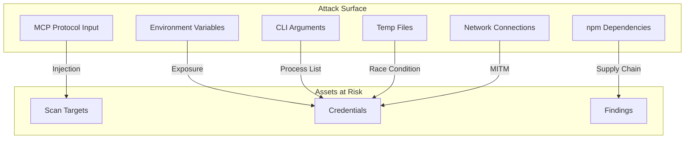
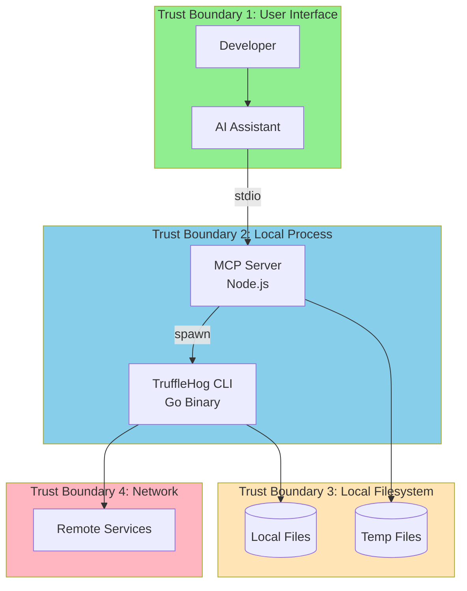
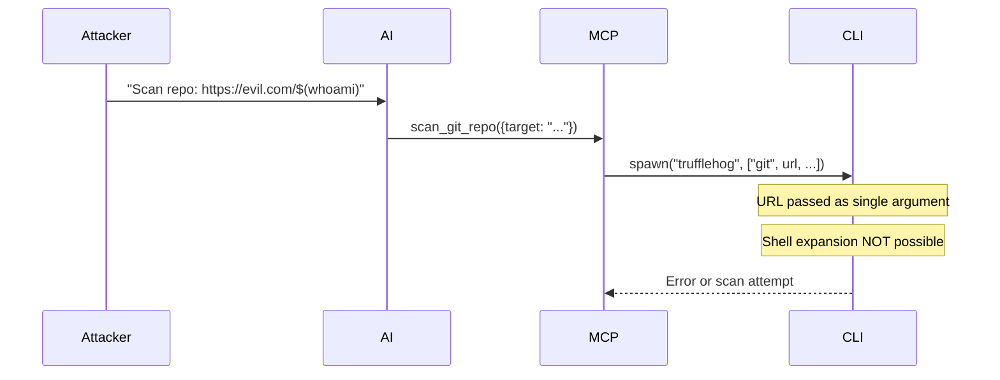
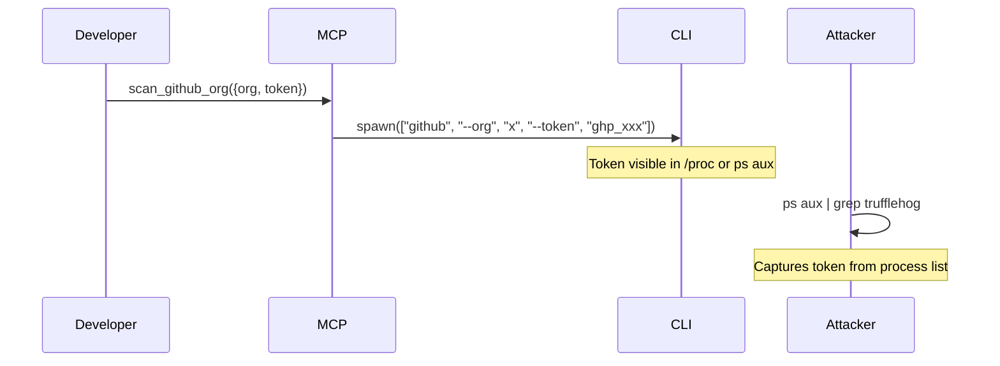
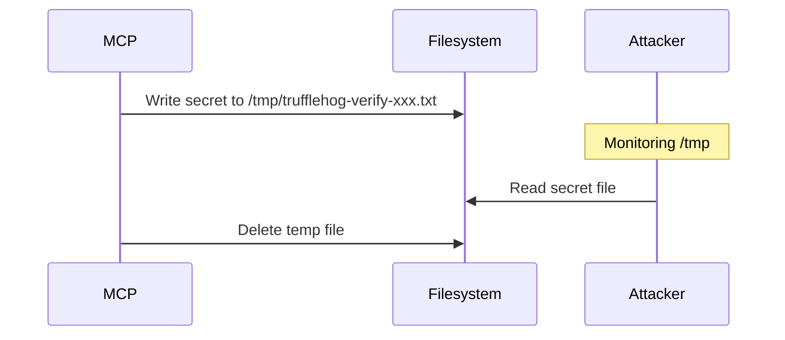
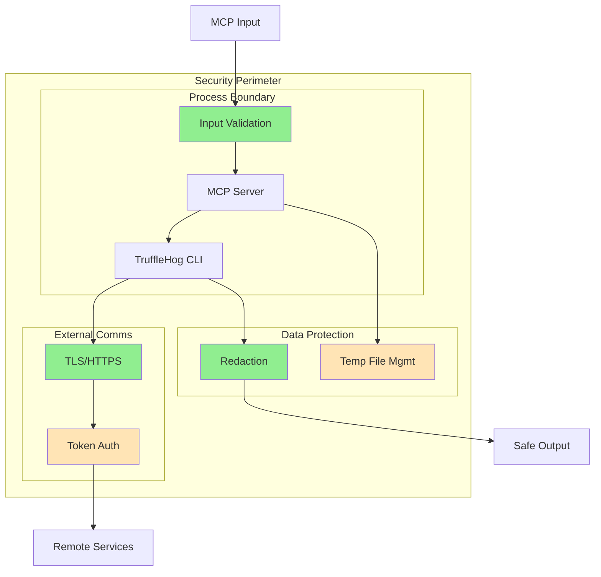

# Security Architecture - TruffleHog MCP Server

## Overview

This document provides a comprehensive security analysis of the TruffleHog MCP Server, including threat modeling, security controls, and recommendations.

## Threat Model Summary

### Key Assets

| Asset | Description | Value | Exposure |
|-------|-------------|-------|----------|
| Source Code | Repositories being scanned | High | Read access during scan |
| Detected Secrets | API keys, tokens, passwords | Critical | Processed and displayed |
| GitHub Tokens | Authentication for org scans | High | Passed as CLI argument |
| AWS Credentials | Authentication for S3 scans | High | Via environment/SDK |
| Enterprise API Key | Scanner authentication | High | Environment variable |
| Local Filesystem | Files accessible by process | Medium | Read access for scans |

### Adversary Profiles

| Adversary | Motivation | Capability | Attack Vector |
|-----------|------------|------------|---------------|
| Malicious AI Prompt | Data exfiltration | Medium | Prompt injection via MCP |
| Compromised Dependency | Supply chain attack | High | npm package compromise |
| Local Attacker | Credential theft | Medium | Process inspection, temp files |
| Network Attacker | MITM, credential interception | Medium | Network interception |
| Insider Threat | Data access | High | Direct system access |

### Attack Surface



## Trust Boundaries



## Security Controls

### Authentication and Authorization

| Control | Status | Description |
|---------|--------|-------------|
| MCP Authentication | None | MCP protocol has no built-in auth |
| Enterprise API Auth | Implemented | Token-based via environment variable |
| GitHub API Auth | Passed Through | Token provided per-request |
| AWS Auth | Delegated | AWS SDK credential chain |
| Local Filesystem Auth | OS-level | Process runs as user |

### Input Validation

| Validation | Implementation | Effectiveness |
|------------|----------------|---------------|
| Path validation | `validatePath()` | Medium |
| Null byte check | Implemented | High |
| Shell injection | `spawn()` with args | High |
| URL validation | Not implemented | None |
| Argument sanitization | Not implemented | None |

**Code Reference** (`src/index.ts` lines 197-207):
```typescript
function validatePath(inputPath: string): string {
  const resolvedPath = path.resolve(inputPath);
  if (inputPath.includes('\0')) {
    throw new Error("Invalid path: contains null bytes");
  }
  return resolvedPath;
}
```

### Command Execution Security

| Control | Status | Notes |
|---------|--------|-------|
| No shell execution | Implemented | `shell: false` in spawn |
| Argument array | Implemented | Prevents injection |
| Explicit binary path | Not implemented | Uses PATH lookup |

**Code Reference** (`src/index.ts` lines 70-73):
```typescript
const proc = spawn("trufflehog", args, {
  stdio: ["pipe", "pipe", "pipe"],
  shell: false, // Explicitly disable shell
});
```

### Data Protection

| Data | Protection | Location |
|------|------------|----------|
| Detected secrets | Redaction | TruffleHog CLI |
| API tokens | Process memory | Not persisted |
| Temp files | Deleted after use | OS temp directory |
| Enterprise key | Environment only | Not logged |

## Threat Analysis

### STRIDE Analysis

| Threat | Category | Mitigation | Risk |
|--------|----------|------------|------|
| Prompt injection via MCP | Spoofing | MCP schema validation | Medium |
| Token in process list | Information Disclosure | None | High |
| Temp file race condition | Information Disclosure | Quick deletion | Medium |
| Dependency compromise | Tampering | npm audit | Medium |
| CLI binary tampering | Tampering | None | Low |
| DoS via large scans | Denial of Service | None | Medium |
| Privilege escalation | Elevation | Process isolation | Low |

### Detailed Threat Scenarios

#### T1: Command Injection via Repository URL



**Verdict**: Mitigated by `spawn()` with shell disabled.

#### T2: Token Exposure via Process List



**Verdict**: Vulnerability - tokens passed as arguments are visible.

#### T3: Temp File Race Condition



**Verdict**: Brief exposure window exists.

## Security Recommendations

### Critical Priority

| Recommendation | Rationale | Effort |
|----------------|-----------|--------|
| Pass tokens via stdin/env | Avoid process list exposure | Medium |
| Use secure temp files | Prevent race conditions | Low |
| Implement URL validation | Prevent SSRF-like attacks | Low |

### High Priority

| Recommendation | Rationale | Effort |
|----------------|-----------|--------|
| Add dependency scanning | Supply chain security | Low |
| Pin TruffleHog CLI version | Reproducible security | Low |
| Implement rate limiting | DoS prevention | Medium |

### Medium Priority

| Recommendation | Rationale | Effort |
|----------------|-----------|--------|
| Add audit logging | Compliance, forensics | Medium |
| Implement output size limits | Memory exhaustion prevention | Low |
| Sanitize error messages | Prevent information leakage | Low |

## Supply Chain Security

### Dependencies Analysis

```
Production Dependencies:
- @modelcontextprotocol/sdk: ^1.0.0 (MCP protocol)
- axios: ^1.6.0 (HTTP client, unused in current code)
- yaml: ^2.3.4 (YAML parsing, unused in current code)

Dev Dependencies:
- @types/node: ^20.10.0
- typescript: ^5.3.0
```

### Dependency Risks

| Package | Risk | Notes |
|---------|------|-------|
| @modelcontextprotocol/sdk | Low | Official Anthropic package |
| axios | Medium | High-profile target, not currently used |
| yaml | Low | Mature package, not currently used |

### Recommendations

1. Remove unused dependencies (axios, yaml)
2. Run `npm audit` regularly
3. Consider using lockfile for reproducibility
4. Implement SBOM generation

## Compliance Considerations

### Data Handling

| Requirement | Status | Gap |
|-------------|--------|-----|
| Secret redaction | Implemented | Via TruffleHog CLI |
| Audit logging | Not implemented | No logging |
| Data retention policy | Not applicable | In-memory only |
| Encryption at rest | Not applicable | No persistence |
| Encryption in transit | TLS for remote | Via CLI |

### Access Control

| Requirement | Status | Gap |
|-------------|--------|-----|
| Authentication | None | MCP has no auth |
| Authorization | None | No RBAC |
| Least privilege | Partial | Runs as user |

## Security Architecture Diagram



## Incident Response

### Potential Incidents

| Incident | Detection | Response |
|----------|-----------|----------|
| Token exposure | Process monitoring | Rotate token immediately |
| Unauthorized scan | Audit logs (if implemented) | Review access |
| Dependency compromise | npm audit alerts | Update/patch |
| CLI vulnerability | TruffleHog releases | Update CLI |

### Response Procedures

1. **Token Exposure**
   - Immediately revoke exposed token
   - Generate new token
   - Update environment configuration
   - Audit for unauthorized access

2. **Dependency Vulnerability**
   - Run `npm audit`
   - Update affected packages
   - Test functionality
   - Deploy update

## Open Questions and Gaps

1. **No Authentication**: MCP protocol lacks authentication; relies on process isolation
2. **Token in Process List**: GitHub tokens visible to any process on system
3. **No Rate Limiting**: Potential for resource exhaustion
4. **No Audit Logging**: Cannot track who scanned what
5. **Unused Dependencies**: axios and yaml increase attack surface unnecessarily
6. **No Integrity Verification**: TruffleHog CLI binary not verified
7. **No Secrets Management Integration**: Tokens in environment vs. vault
8. **No Network Egress Control**: CLI can connect to any endpoint
