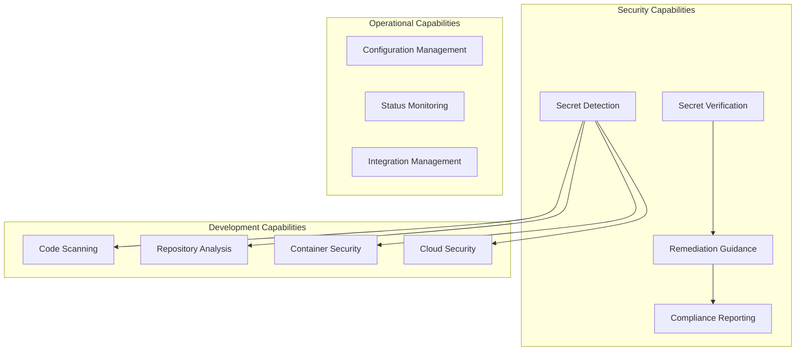
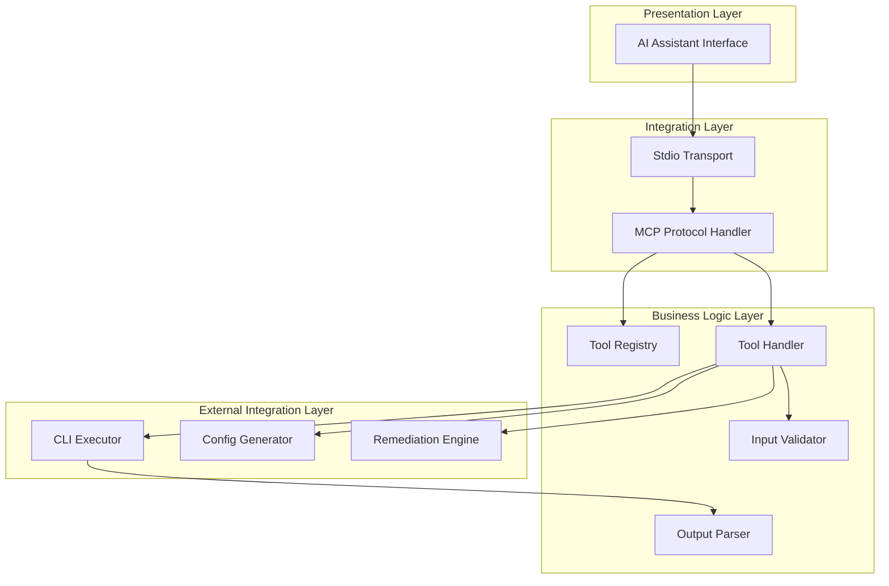
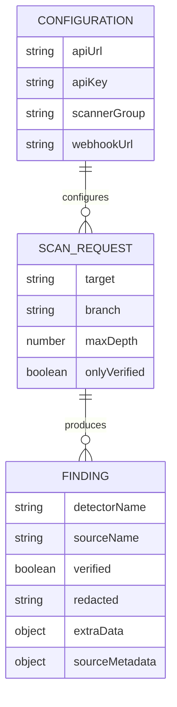
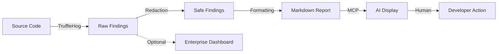
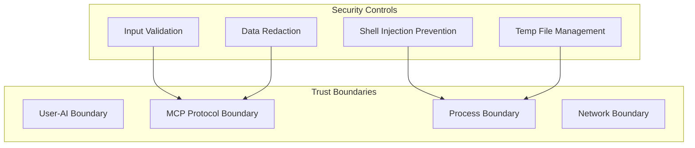

# TOGAF Architecture Mapping - TruffleHog MCP Server

## Overview

This document maps the TruffleHog MCP Server architecture to TOGAF (The Open Group Architecture Framework) domains and provides views aligned with enterprise architecture practices.

## Architecture Vision

### Business Goals

| Goal | Description | Alignment |
|------|-------------|-----------|
| Security Enablement | Enable developers to find secrets in code | Core capability |
| Developer Experience | Seamless AI-assisted security scanning | MCP integration |
| Shift-Left Security | Catch secrets early in development | Local scanning |
| Enterprise Visibility | Centralized findings management | Enterprise integration |

### Key Stakeholders

| Stakeholder | Concerns | Architecture Impact |
|-------------|----------|---------------------|
| Developers | Easy to use, fast, accurate | CLI wrapper, natural language |
| Security Team | Coverage, compliance, visibility | 800+ detectors, Enterprise |
| DevOps | Integration, automation | MCP protocol, CLI interface |
| Management | Risk reduction, cost | Automated scanning |

## Business Architecture

### Business Capability Map



### Business Processes

| Process | Description | System Support |
|---------|-------------|----------------|
| Secret Scanning | Detect secrets in various sources | Core capability |
| Secret Verification | Validate if secrets are active | verify_secret tool |
| Remediation | Guide developers on fixing issues | analyze_finding tool |
| Configuration | Set up scanning parameters | generate_config tool |

### Business Drivers

1. **Risk Reduction**: Prevent credential leaks before they reach production
2. **Developer Productivity**: Integrate security into existing AI workflows
3. **Compliance**: Meet security requirements for secret management
4. **Cost Optimization**: Automate manual security review processes

### Constraints

| Constraint | Type | Impact |
|------------|------|--------|
| TruffleHog CLI required | Technical | External dependency |
| Local execution only | Operational | No centralized service |
| MCP protocol | Technical | Limited to compatible clients |
| No persistence | Technical | Stateless operation |

## Application Architecture

### Application Building Blocks



### Application Interfaces

| Interface | Type | Protocol | Description |
|-----------|------|----------|-------------|
| MCP Input | Inbound | JSON-RPC/stdio | Tool calls from AI |
| MCP Output | Outbound | JSON-RPC/stdio | Tool responses to AI |
| CLI Execution | Outbound | Process spawn | TruffleHog invocation |
| Filesystem | Outbound | Node.js fs | Config/temp files |

### Service Contracts

#### Tool: scan_git_repo

```yaml
operation: scan_git_repo
input:
  target: string (required) - Git URL or path
  branch: string (optional) - Specific branch
  maxDepth: number (optional) - Commit depth
  onlyVerified: boolean (optional) - Verified secrets only
output:
  format: markdown
  content: Finding list with detector, verification, redacted secret
errors:
  - "TruffleHog CLI not installed"
  - "Error scanning repository: <details>"
```

#### Tool: verify_secret

```yaml
operation: verify_secret
input:
  secret: string (required) - Secret value
  detectorType: string (required) - Detector type
output:
  format: markdown
  content: Verification status, detector info, warning if active
errors:
  - "TruffleHog CLI not installed"
  - "Error verifying secret: <details>"
```

### Application Portfolio

| Application | Category | Status | Dependencies |
|-------------|----------|--------|--------------|
| TruffleHog MCP Server | Security Tooling | Active | MCP SDK, Node.js |
| TruffleHog CLI | Security Scanner | External | Go runtime |
| Claude CLI | AI Interface | External | MCP protocol |
| TruffleHog Enterprise | Enterprise Platform | Optional | Cloud hosted |

## Data Architecture

### Data Entities



### Data Stores

| Store | Type | Persistence | Content |
|-------|------|-------------|---------|
| Process Memory | Volatile | Request duration | Arguments, findings |
| Temp Files | Ephemeral | Seconds | Secrets for verification |
| Config Files | User-managed | Permanent | Scanner configurations |
| Enterprise | Cloud | Permanent | Historical findings |

### Data Classification

| Data Type | Classification | Retention | Encryption |
|-----------|---------------|-----------|------------|
| Scan targets | Internal | None | No |
| Raw secrets | Confidential | Never stored | N/A |
| Redacted secrets | Internal | Per request | No |
| API credentials | Secret | Env vars only | No |
| Findings | Internal | Enterprise only | TLS in transit |

### Data Lineage



## Technology Architecture

### Technology Standards

| Category | Standard | Version | Notes |
|----------|----------|---------|-------|
| Runtime | Node.js | 18+ | ES2022 target |
| Language | TypeScript | 5.3+ | Strict mode |
| Protocol | MCP | 1.0 | JSON-RPC over stdio |
| CLI | TruffleHog | Latest | Go binary |
| Module System | ESM | ES Modules | No CommonJS |

### Technology Building Blocks

```mermaid
graph TB
    subgraph "Application Platform"
        Node[Node.js 18+]
        TS[TypeScript 5.3+]
        ESM[ES Modules]
    end

    subgraph "Framework Layer"
        MCP_SDK[@modelcontextprotocol/sdk]
    end

    subgraph "Runtime Dependencies"
        FS[fs module]
        Path[path module]
        OS[os module]
        CP[child_process module]
    end

    subgraph "External Tools"
        TH[TruffleHog CLI]
    end

    TS --> Node
    ESM --> Node
    MCP_SDK --> Node
    FS --> Node
    Path --> Node
    OS --> Node
    CP --> Node
    CP --> TH
```

### Platform Services

| Service | Provider | Purpose |
|---------|----------|---------|
| Compute | Local machine | Process execution |
| Networking | OS network stack | Remote scanning |
| Storage | Local filesystem | Temp files, configs |
| Security | TruffleHog CLI | Secret detection |

### Technology Roadmap

| Phase | Technology | Purpose | Timeline |
|-------|------------|---------|----------|
| Current | Node.js + CLI wrapper | MVP | Complete |
| Future 1 | HTTP transport | Remote deployment | TBD |
| Future 2 | Container packaging | Easier deployment | TBD |
| Future 3 | Native integration | Performance | TBD |

## Security Architecture

### Security Principles

| Principle | Implementation | Status |
|-----------|---------------|--------|
| Defense in Depth | Multiple validation layers | Partial |
| Least Privilege | Run as user, no root | Implemented |
| Secure by Default | No shell execution | Implemented |
| Data Minimization | No persistence | Implemented |

### Security Patterns



### Security Policies

| Policy | Enforcement | Gap |
|--------|-------------|-----|
| No raw secret output | CLI redaction | None |
| No shell execution | spawn() config | None |
| Temp file cleanup | Finally block | Race condition |
| Token handling | Process memory | Visible in ps |

## TOGAF Architecture Development Method (ADM) Alignment

### Phase A: Architecture Vision

- **Stakeholders**: Developers, Security team, DevOps
- **Business Goals**: Shift-left security, automated scanning
- **Architecture Vision**: AI-integrated secret detection

### Phase B: Business Architecture

- **Business Services**: Secret scanning, verification, remediation
- **Business Processes**: Code review, security audit
- **Business Capabilities**: Security tooling

### Phase C: Information Systems Architecture

- **Application Components**: MCP server, tool handlers
- **Data Entities**: Findings, configurations
- **Application Interfaces**: MCP protocol

### Phase D: Technology Architecture

- **Technology Components**: Node.js, TypeScript, TruffleHog CLI
- **Platform Services**: Local compute, filesystem

### Phase E-F: Opportunities and Migration

| Opportunity | Priority | Effort | Impact |
|-------------|----------|--------|--------|
| Add HTTP transport | Medium | Medium | Remote deployment |
| Container packaging | Medium | Low | Easier deployment |
| Unit test coverage | High | Medium | Reliability |
| Audit logging | Medium | Low | Compliance |

### Phase G: Implementation Governance

| Standard | Requirement | Status |
|----------|-------------|--------|
| Code style | TypeScript strict | Compliant |
| Security | No shell execution | Compliant |
| Documentation | Architecture docs | This document |
| Testing | Unit tests | Gap |

## Architecture Principles

| Principle | Rationale | Implications |
|-----------|-----------|--------------|
| Simplicity | Reduce attack surface | Single file, minimal deps |
| Statelessness | Reliability, scalability | No persistence |
| Security First | Protect secrets | Redaction, validation |
| Standards Based | Interoperability | MCP protocol |
| Loose Coupling | Flexibility | CLI wrapper pattern |

## Open Questions and Gaps

1. **No Formal Enterprise Alignment**: Not part of larger EA framework
2. **Limited Governance**: No formal review process
3. **No SLA Definition**: No performance guarantees
4. **No Disaster Recovery**: Local-only, no backup
5. **No Capacity Planning**: No resource estimation
6. **No Technology Lifecycle**: Dependency updates ad-hoc
